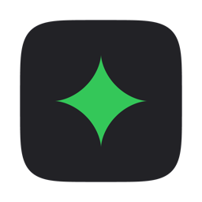
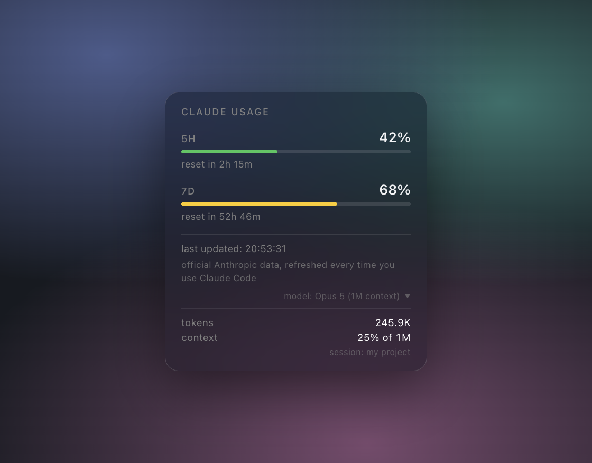

<p align="center">
  
</p>

<h1 align="center">Claude Usage</h1>

<p align="center">
  <b>Know how much Claude Code quota you have left — before you hit the wall.</b><br>
  A macOS menu bar app that keeps Anthropic's official usage figure in front of you, all the time.
</p>

<p align="center">
  <a href="https://github.com/malenitaa/usage/releases/latest"></a>
  <a href="./LICENSE"></a>
  
  <a href="./SECURITY.md"></a>
</p>

<p align="center">
  
</p>

---

## Why

Claude Code Pro and Max accounts run two usage limits at once: a **5-hour**
window and a **7-day** one. Most people find out where they stand by hitting the
limit in the middle of something.

This puts the number in your menu bar instead. It is Anthropic's own figure,
taken from what Claude Code itself reports — not an estimate rebuilt from token
counts.

## What you get

**A colour-coded icon** in the menu bar, in your Mac's own system colours:

- green — plenty left (0-50%)
- yellow — halfway there (50-80%)
- red — running out (80-100%)

**A popover**, one click away: the exact percentage for each window, a countdown
to the reset, and when the figure was last refreshed.

**Your current session**, behind a small disclosure — how many tokens it has
used, and how much of the context window is gone. Everything above it is per
account; this part is per session, so it carries the session name.

**It looks like macOS**, because it borrows from macOS: the panel is the same
translucent material Control Center uses, it follows your light/dark appearance,
and the traffic-light colours are the system's own greens, yellows and reds.

**It speaks your language.** English and Spanish, chosen automatically from your
Mac's system language, with any other language falling back to English.

## Install

Go to **[INSTALL.md](INSTALL.md)** — written for anyone, no programming needed.

You will need macOS, [Claude Code](https://claude.com/claude-code) with a Pro or
Max claude.ai account, `jq`, and Node.js.

## How it works

Two small pieces, deliberately kept apart:

1. **A statusline script.** Claude Code runs it on its own every few seconds
   while you work. It writes the quota figures to one small local file,
   `~/.claude/quota-status/current.json`.
2. **The menu bar app.** It reads that file every ~18 seconds and draws the icon
   and the popover. That is all it does.

Only the script ever sees the real data, and the only file it can write is its
own. The app only reads. Never open the app and the data is still recorded;
never run the script and the app says so rather than inventing a number.

## Settings

One file, `~/.claude/usage-app-config.json`, one JSON object:

```json
{
  "trayDisplay": ["bar", "5h", "7d"],
  "panelStyle": "glass",
  "statuslineDisplay": "numbers"
}
```

Every key is optional. Anything missing, misspelled or invalid falls back to its
default instead of breaking.

### `trayDisplay` — what sits in the menu bar

Three independent pieces: the colour-coded icon (`bar`), the 5-hour percentage
(`5h`), the 7-day percentage (`7d`). Any combination works.

| You want to see                        | `trayDisplay`         |
| -------------------------------------- | --------------------- |
| Everything                             | `["bar", "5h", "7d"]` |
| Just the colour-coded icon *(default)* | `["bar"]`             |
| Just the two percentages               | `["5h", "7d"]`        |
| Only the 5-hour percentage             | `["5h"]`              |
| Only the 7-day percentage              | `["7d"]`              |
| Nothing (a plain dot, still clickable) | `[]`                  |

Order does not matter. The macOS menu bar cannot draw a real progress bar next
to an icon, so the colour of `"bar"` is the closest thing to one. Takes effect
on the next refresh (~18s), no restart.

### `panelStyle` — how the popover looks

- `"glass"` *(default)* — the translucent, blurred material, like Control Center.
- `"solid"` — an opaque panel in the system colours. Easier to read over busy
  wallpaper, and the better choice if translucency distracts you.

This one needs the app restarted: the two use different kinds of window.

### `statuslineDisplay` — the line in your terminal

- `"numbers"` *(default)* — `Claude usage - 5h: 44%  7d: 38%`
- `"bar"` — `Claude usage - 5h [####......]  7d [####......]`, drawn with
  Unicode block glyphs. If your terminal font shows boxes or `?`, use
  `"numbers"`.
- `"none"` — prints nothing when the read succeeds. Errors are always shown,
  because those mean something needs fixing.

Takes effect the next time Claude Code refreshes the statusline.

## Privacy and security

- **No network.** Neither piece ever makes an internet call.
- **No credentials.** It never touches your API key, your session token, or any
  account data.
- **No telemetry.** No account, no login, no tracking, nothing phoned home.
- **One local file**, readable only by you, that you can open and inspect
  whenever you like.

The threat model and how the code handles untrusted input are in
**[SECURITY.md](SECURITY.md)**.

## About the numbers

The percentage can differ slightly from claude.ai for a while. Two honest
reasons:

- The figure arrives through Claude Code sessions as they refresh, not live.
- Several sessions share one file, so the app keeps the **highest** reading
  reported for a window. Usage inside a window only ever goes up, so a lower
  reading is always an older snapshot from some other session.

The raw figure can also go past 100%: the limit is checked when a request
starts, not when it finishes, so one admitted just under the cap runs to
completion and its full cost lands on the window afterwards. Anthropic's own
usage screen caps what it shows at 100%, and so does this.

## Development

```bash
cd app
npm install
npm run dev     # run the app
npm run build   # package the .dmg into app/dist/
```

Built with Electron. macOS only — see [SECURITY.md](SECURITY.md) for why a
Windows port is not a recompile.

## Enjoyed it?

If this was useful and you would like to support the project:

- [Cafecito](https://cafecito.app/rezamalena)
- [Ko-fi](https://ko-fi.com/malenitaa)

## License

[MIT](LICENSE)
